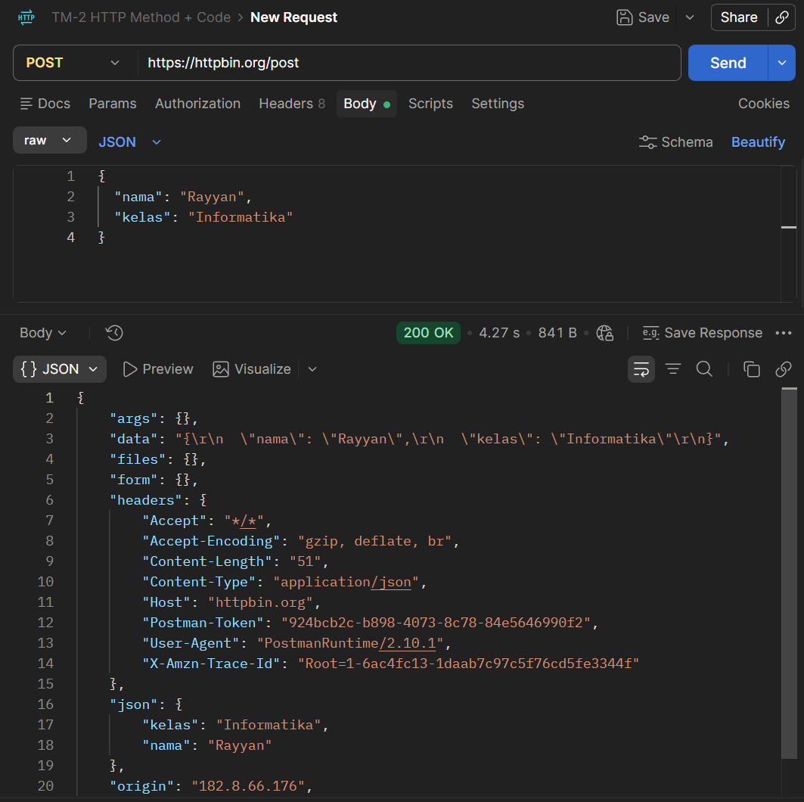

# Tugas Mandiri 1 — Mengenal HTTP Method dan Endpoint

## Tujuan

Memahami hubungan antara HTTP method, endpoint, parameter, request, dan response menggunakan layanan publik HTTPBin.

## Endpoint yang Digunakan

| No. | Method | Endpoint | Fungsi | Data yang Dikirim | Status | Hasil |
|---|---|---|---|---|---:|---|
| 1 | GET | `https://httpbin.org/get?nama=Rayyan&kelas=Informatika` | Menguji request GET | Query parameter `nama` dan `kelas` | 200 | Response menampilkan kembali informasi request yang diterima server. |
| 2 | POST | `https://httpbin.org/post` | Menguji request POST | JSON/body | 200 | Response menampilkan kembali data yang dikirim pada request body. |
| 3 | PUT | `https://httpbin.org/put` | Menguji request PUT | JSON/body | 200 | Response menampilkan kembali data PUT yang diterima server. |
| 4 | PATCH | `https://httpbin.org/patch` | Menguji request PATCH | JSON/body | 200 | Response menampilkan kembali data PATCH yang diterima server. |
| 5 | DELETE | `https://httpbin.org/delete` | Menguji request DELETE | Tidak ada | 200 | Response menampilkan informasi request DELETE yang diterima server. |

> Setelah pengujian di Postman, sesuaikan kolom **Data yang Dikirim** dan **Hasil** dengan response aktual. Modul meminta kelima endpoint tersebut diuji dan hasil sebenarnya dicatat. 

## 1. GET `/get`

### Request

```text
GET https://httpbin.org/get?nama=Rayyan&kelas=Informatika
```

### Hasil

HTTPBin mengembalikan response yang memuat informasi request yang diterima, termasuk query parameter yang dikirim.

### Bukti


## 2. POST `/post`

### Request

```text
POST https://httpbin.org/post
```

Body JSON:

```json
{
  "nama": "Rayyan",
  "kelas": "Informatika"
}
```

### Hasil

HTTPBin mengembalikan informasi request beserta data JSON yang dikirim melalui request body.

### Bukti



## 3. PUT `/put`

### Request

```text
PUT https://httpbin.org/put
```

Body JSON:

```json
{
  "nama": "Rayyan",
  "kelas": "Informatika"
}
```

### Hasil

HTTPBin mengembalikan informasi request PUT dan data yang dikirim melalui body.

## 4. PATCH `/patch`

### Request

```text
PATCH https://httpbin.org/patch
```

Body JSON:

```json
{
  "nama": "Rayyan",
  "kelas": "Informatika"
}
```

### Hasil

HTTPBin mengembalikan informasi request PATCH dan data yang dikirim melalui body.

## 5. DELETE `/delete`

### Request

```text
DELETE https://httpbin.org/delete
```

### Hasil

HTTPBin mengembalikan informasi request DELETE yang diterima server.

## Kesimpulan

Pengujian pada HTTPBin menunjukkan bahwa method GET, POST, PUT, PATCH, dan DELETE memiliki tujuan yang berbeda dalam komunikasi HTTP. GET dapat membawa parameter melalui URL, sedangkan POST, PUT, dan PATCH dapat mengirim data melalui request body. DELETE digunakan untuk menguji permintaan penghapusan resource. Pada tabel tugas, status yang dicantumkan oleh modul untuk kelima pengujian adalah `200`.

## Lampiran

- Screenshot GET: `../../kegiatan-praktikum/screenshots/httpbin-get.png`
- Screenshot POST: `../../kegiatan-praktikum/screenshots/httpbin-post.png`
- PR tugas: akan ditambahkan setelah Pull Request dibuat.
- PR yang saya review: akan ditambahkan setelah melakukan review PR rekan.
- Reviewer: akan ditambahkan setelah review.
