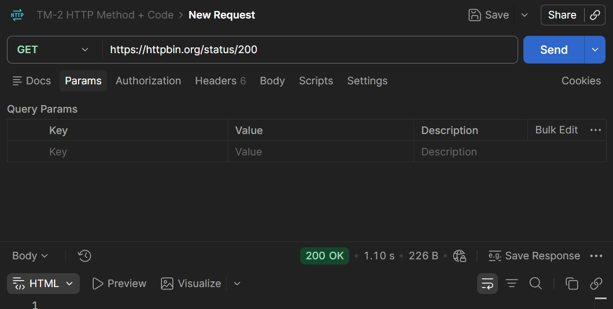
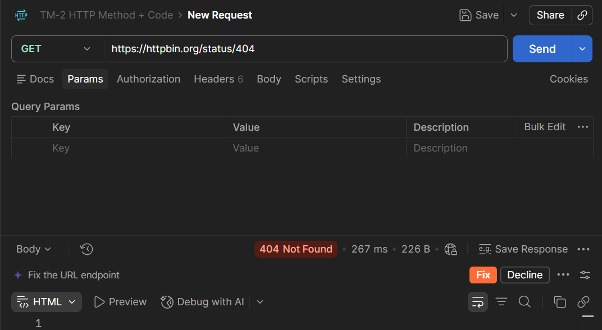
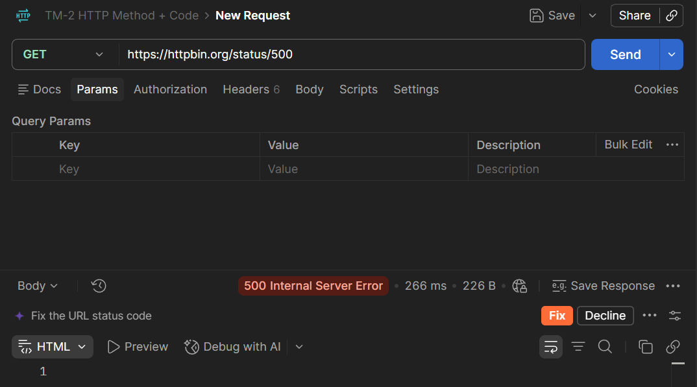

# Tugas Mandiri 2 — Memahami HTTP Status Code

## Tujuan

Memahami arti HTTP status code dan mengetahui bagaimana server memberikan kode status yang berbeda untuk menggambarkan hasil sebuah request.

Pengujian dilakukan menggunakan endpoint HTTPBin `/status/:code` sesuai instruksi modul. Modul meminta pengujian minimal status `200`, `201`, `400`, `401`, `403`, `404`, dan `500`, kemudian hasilnya dicatat dalam tabel serta menjawab empat pertanyaan.

## Hasil Pengujian

| Status Code | Arti | Hasil Pengujian | Kapan Digunakan |
|---|---|---|---|
| **200 OK** | Request berhasil diproses. | `GET /status/200` menghasilkan **200 OK**. | Digunakan ketika request berhasil dan server memberikan respons yang berhasil. |
| **201 Created** | Request berhasil dan menghasilkan resource baru. | `GET /status/201` menghasilkan **201 Created**. | Umumnya digunakan ketika request berhasil membuat resource baru. |
| **400 Bad Request** | Request tidak dapat diproses karena terdapat kesalahan pada request. | `GET /status/400` menghasilkan **400 Bad Request**. | Digunakan ketika request dari client tidak valid atau tidak dapat dipahami server. |
| **401 Unauthorized** | Request membutuhkan autentikasi yang valid. | `GET /status/401` menghasilkan **401 Unauthorized**. | Digunakan ketika client belum memberikan kredensial autentikasi yang diperlukan atau kredensialnya tidak valid. |
| **403 Forbidden** | Server memahami request tetapi menolak memberikan akses. | `GET /status/403` menghasilkan **403 Forbidden**. | Digunakan ketika client tidak memiliki izin untuk mengakses resource. |
| **404 Not Found** | Resource atau endpoint yang diminta tidak ditemukan. | `GET /status/404` menghasilkan **404 Not Found**. | Digunakan ketika resource atau URL yang diminta tidak tersedia. |
| **500 Internal Server Error** | Terjadi kesalahan internal pada sisi server. | `GET /status/500` menghasilkan **500 Internal Server Error**. | Digunakan ketika server mengalami kondisi tak terduga sehingga tidak dapat memenuhi request. |

> Catatan: pada HTTPBin, endpoint `/status/:code` sengaja digunakan untuk menghasilkan kode status tertentu. Jadi pengujian ini mensimulasikan berbagai status HTTP; misalnya `401` dan `403` di sini tidak berarti HTTPBin sedang melakukan proses login atau pemeriksaan hak akses nyata.

## Bukti Pengujian

### 200 OK

### 404 Not Found

### 500 Internal Server Error

Tiga screenshot di atas menunjukkan tiga status code yang berbeda sebagai bukti pengujian.

## Jawaban Pertanyaan

### 1. Apa perbedaan `400` dan `404`?

`400 Bad Request` menunjukkan bahwa request yang dikirim client bermasalah atau tidak valid sehingga server tidak dapat memprosesnya dengan benar. Sementara itu, `404 Not Found` menunjukkan bahwa resource atau endpoint yang diminta tidak ditemukan. Jadi, `400` berfokus pada masalah pada request, sedangkan `404` berfokus pada resource yang tidak tersedia.

### 2. Apa perbedaan `401` dan `403`?

`401 Unauthorized` berkaitan dengan autentikasi. Status ini digunakan ketika client belum memberikan kredensial yang diperlukan atau kredensialnya tidak valid. `403 Forbidden` menunjukkan bahwa server memahami request tetapi akses terhadap resource tersebut ditolak karena client tidak memiliki izin yang sesuai.

### 3. Mengapa `500` menunjukkan masalah pada sisi server?

Status `500 Internal Server Error` menunjukkan bahwa server mengalami kondisi atau kesalahan internal yang membuat request tidak dapat diselesaikan. Berbeda dari status `4xx` yang umumnya berkaitan dengan request dari client, status `500` menunjukkan kegagalan pada proses di sisi server.

### 4. Apakah semua error HTTP berarti server mengalami kerusakan?

Tidak. Tidak semua error HTTP berarti server rusak. Status `4xx`, seperti `400` dan `404`, umumnya menunjukkan adanya masalah pada request client atau resource yang diminta. Status `5xx`, seperti `500`, lebih berkaitan dengan kegagalan pada sisi server.

## Kesimpulan

Pengujian menggunakan HTTPBin menunjukkan bahwa HTTP status code memberikan informasi mengenai hasil pemrosesan sebuah request. Status `2xx` menunjukkan keberhasilan, status `4xx` umumnya berkaitan dengan masalah pada request atau akses dari client, sedangkan status `5xx` menunjukkan masalah pada sisi server. Dengan menguji beberapa kode status secara langsung, perbedaan fungsi setiap status code menjadi lebih mudah dipahami.
