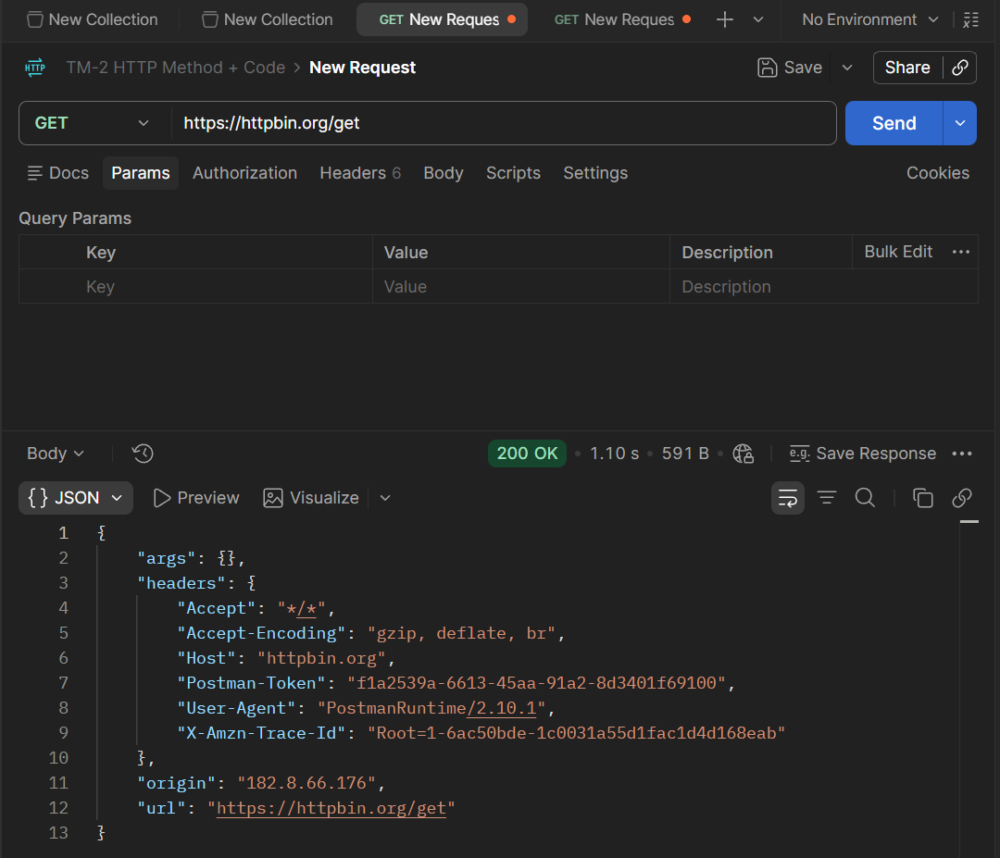
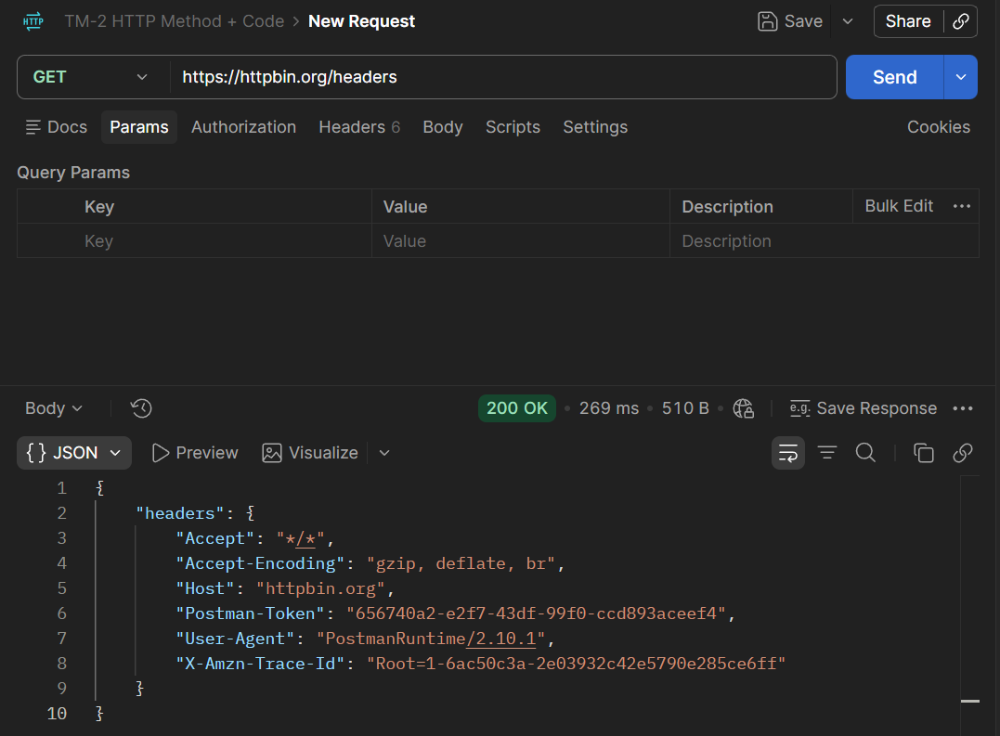

# Tugas Mandiri 3 — Request dan Response HTTP

## Tujuan

Memahami struktur request dan response HTTP menggunakan HTTPBin, khususnya penggunaan endpoint, query parameter, dan HTTP header.

## Pengujian

### 1. GET `/get`

**Request**

```text
GET https://httpbin.org/get
```

**Hasil**

Request berhasil diproses dan menghasilkan status **200 OK**. Response menampilkan informasi request yang diterima oleh HTTPBin, seperti `headers`, `origin`, dan `url`.

**Bukti**



---

### 2. GET `/get` dengan Query Parameter

**Request**

```text
GET https://httpbin.org/get?nama=Rayyan&kelas=Informatika
```

**Query Parameter**

| Parameter | Nilai |
|---|---|
| `nama` | `Rayyan` |
| `kelas` | `Informatika` |

**Hasil**

Request berhasil diproses. Query parameter dikirim melalui URL dan HTTPBin mengembalikannya pada bagian `args` dalam response.

---

### 3. GET `/headers`

**Request**

```text
GET https://httpbin.org/headers
```

**Hasil**

Request berhasil diproses dan menghasilkan status **200 OK**. Response menampilkan header yang diterima oleh HTTPBin, seperti `Accept`, `Accept-Encoding`, `Host`, `User-Agent`, dan header lainnya.

**Bukti**



---

## Jawaban Pertanyaan

### 1. Apa yang dimaksud dengan request?

Request adalah permintaan yang dikirim oleh client kepada server untuk meminta suatu resource atau melakukan suatu operasi. Request dapat terdiri dari HTTP method, URL, query parameter, header, dan request body.

### 2. Apa yang dimaksud dengan response?

Response adalah balasan yang diberikan server setelah menerima dan memproses request dari client. Response dapat berisi status code, header, dan response body.

### 3. Apa fungsi query parameter?

Query parameter digunakan untuk mengirimkan informasi tambahan melalui URL agar request dapat membawa parameter tertentu. Contohnya:

```text
https://httpbin.org/get?nama=Rayyan&kelas=Informatika
```

Pada URL tersebut, `nama` dan `kelas` merupakan query parameter yang dikirim kepada server.

### 4. Apa fungsi HTTP header?

HTTP header digunakan untuk membawa informasi tambahan yang berkaitan dengan request atau response. Contohnya dapat berupa informasi tentang jenis konten, client, encoding, dan metadata komunikasi HTTP.

Pada endpoint `/headers`, HTTPBin menampilkan header yang diterima dari request.

### 5. Apa perbedaan data pada URL dengan data pada request body?

Data pada URL dikirim sebagai bagian dari alamat request, misalnya melalui query parameter setelah tanda `?`. Sementara data pada request body dikirim di dalam isi request dan tidak menjadi bagian dari URL. Query parameter cocok digunakan untuk memberikan parameter pada request, sedangkan request body digunakan untuk membawa data yang dikirim bersama request, terutama pada method seperti POST, PUT, dan PATCH.

## Kesimpulan

Pengujian menggunakan HTTPBin menunjukkan bahwa request HTTP dapat membawa informasi melalui URL, query parameter, dan header. Response dari server memberikan informasi mengenai hasil request beserta data yang diterima. Pengujian `GET /get` dan `GET /headers` menghasilkan status `200 OK`, sedangkan penggunaan query parameter memungkinkan data seperti `nama` dan `kelas` dikirim melalui URL dan dikembalikan oleh server pada response.
