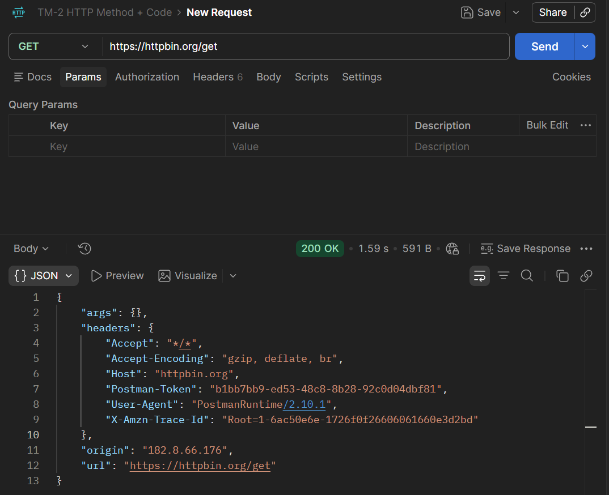
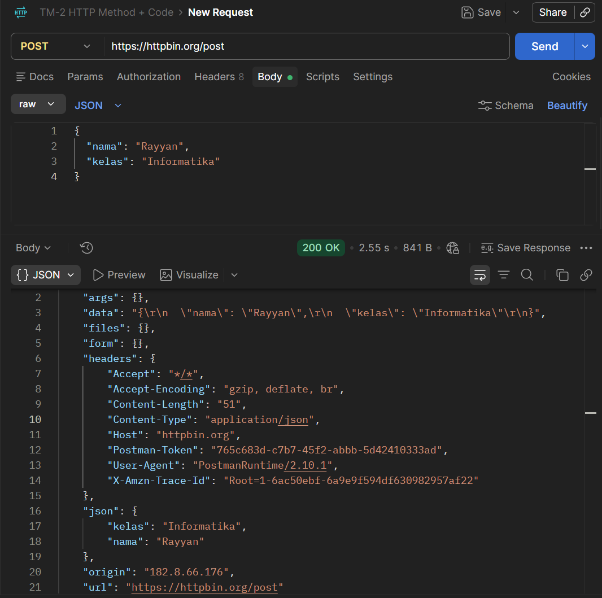
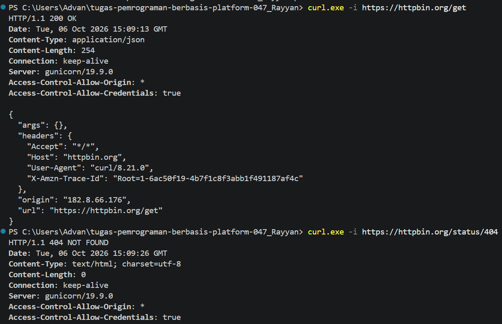
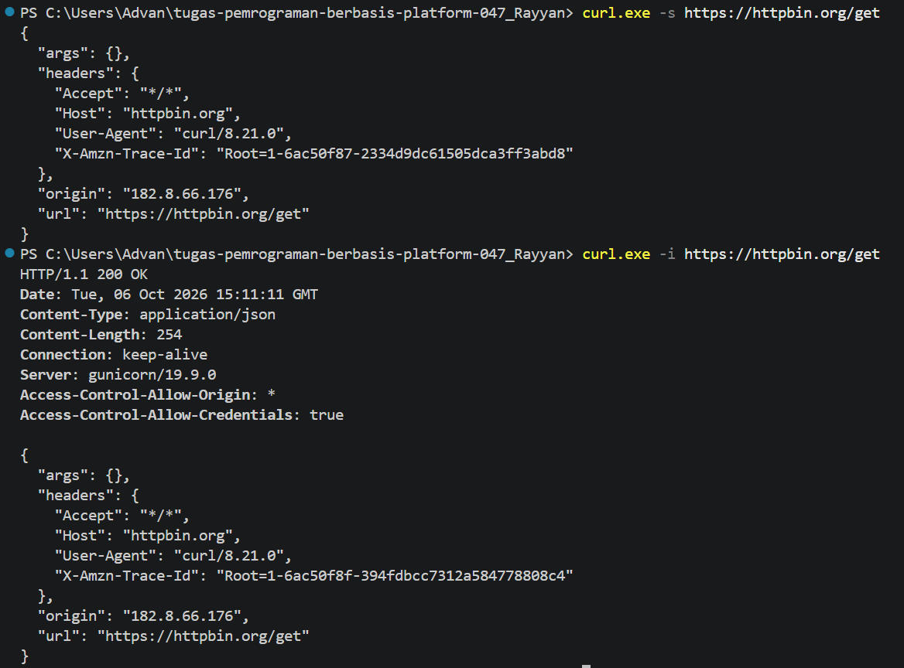

# Tugas Mandiri 4 — HTTP Client + DevTools

## Tujuan

Menguji request HTTP menggunakan Postman dan `curl`, kemudian membandingkan hasil penggunaan opsi `-i` dan `-s`.

## A. Pengujian Menggunakan Postman

### 1. GET `/get`

Request:

```text
GET https://httpbin.org/get
```

Hasil pengujian:

- Status: **200 OK**
- Response berupa JSON.
- Response menampilkan informasi request seperti `args`, `headers`, `origin`, dan `url`.

Bukti:



### 2. POST `/post`

Request:

```text
POST https://httpbin.org/post
```

Body JSON:

```json
{
  "nama": "Rayyan",
  "kelas": "Informatika"
}
```

Hasil pengujian:

- Status: **200 OK**
- Response berupa JSON.
- Data yang dikirim melalui request body muncul kembali pada bagian `json`.
- Header `Content-Type` menunjukkan `application/json`.

Bukti:



## B. Pengujian `curl -i`

### 1. GET `/get`

Perintah:

```powershell
curl.exe -i https://httpbin.org/get
```

Hasil:

```text
HTTP/1.1 200 OK
Content-Type: application/json
Content-Length: 254
Connection: keep-alive
Server: gunicorn/19.9.0
```

Response body kemudian menampilkan JSON hasil request.

### 2. GET `/status/404`

Perintah:

```powershell
curl.exe -i https://httpbin.org/status/404
```

Hasil:

```text
HTTP/1.1 404 NOT FOUND
Content-Type: text/html; charset=utf-8
Content-Length: 0
Connection: keep-alive
Server: gunicorn/19.9.0
```

Request menghasilkan status **404 Not Found**.

Bukti:



## C. Perbandingan `curl -s` dan `curl -i`

### `curl -s`

Perintah:

```powershell
curl.exe -s https://httpbin.org/get
```

Pada hasil pengujian, yang ditampilkan adalah response body berupa JSON tanpa header HTTP di bagian atas.

### `curl -i`

Perintah:

```powershell
curl.exe -i https://httpbin.org/get
```

Pada hasil pengujian, header HTTP ditampilkan terlebih dahulu, kemudian diikuti response body JSON.

Perbedaan tersebut menunjukkan bahwa opsi `-s` digunakan agar output curl tidak menampilkan progress meter atau informasi tambahan yang tidak diperlukan, sedangkan `-i` digunakan untuk menyertakan header response HTTP. `curl -s` lebih cocok ketika hanya membutuhkan isi response, misalnya untuk diproses lebih lanjut. `curl -i` berguna ketika ingin melihat status code dan header response sekaligus.

Bukti:



## Kesimpulan

Pengujian menggunakan Postman dan `curl` sama-sama dapat digunakan untuk mengirim request ke HTTPBin dan melihat response dari server. Postman memberikan antarmuka visual untuk melihat request dan response, sedangkan `curl` memberikan cara pengujian melalui terminal. Opsi `-i` pada curl membantu melihat header dan status HTTP, sedangkan `-s` menghasilkan output yang lebih ringkas dengan fokus pada response.
